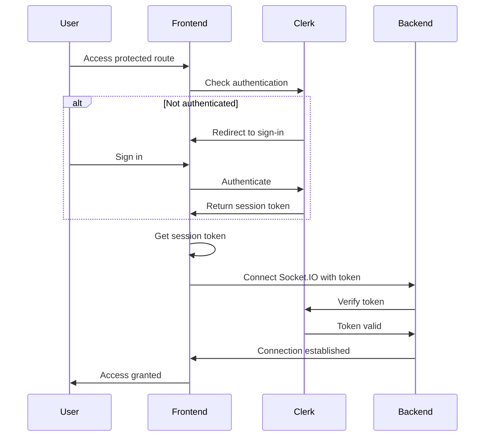

# Clerk Authentication Setup Guide

This guide will help you set up Clerk authentication for the SyncEditor project.

## Prerequisites

- A Clerk account (sign up at [clerk.com](https://clerk.com))
- Node.js and npm installed
- The SyncEditor project cloned locally

## Step 1: Create a Clerk Application

1. Go to [Clerk Dashboard](https://dashboard.clerk.com)
2. Click **"Create Application"**
3. Choose a name for your application (e.g., "SyncEditor")
4. Select your preferred authentication methods:
   - **Email** (recommended)
   - **Google** (optional)
   - **GitHub** (optional)
5. Click **"Create Application"**

## Step 2: Get Your API Keys

After creating your application, you'll be taken to the API Keys page. You'll need two keys:

1. **Publishable Key** - starts with `pk_test_` or `pk_live_`
2. **Secret Key** - starts with `sk_test_` or `sk_live_`

> [!WARNING]
> Never commit your secret key to version control! Keep it secure.

## Step 3: Configure Frontend Environment Variables

1. Navigate to the `synceditor` directory
2. Copy `.env.example` to `.env`:
   ```bash
   cd synceditor
   cp .env.example .env
   ```
3. Open `.env` and add your Clerk publishable key:
   ```bash
   VITE_BACKEND_URL=http://localhost:5555
   VITE_PISTON_API=https://emkc.org/api/v2/piston/execute
   VITE_CLERK_PUBLISHABLE_KEY=pk_test_your_key_here
   ```

## Step 4: Configure Backend Environment Variables

1. Navigate to the `Server` directory
2. Copy `.env.example` to `.env`:
   ```bash
   cd ../Server
   cp .env.example .env
   ```
3. Open `.env` and add your Clerk keys:
   ```bash
   PORT=5555
   FRONTEND_URL=http://localhost:5173
   NODE_ENV=development
   SOCKET_PING_TIMEOUT=120000
   SOCKET_PING_INTERVAL=30000
   CLERK_SECRET_KEY=sk_test_your_secret_key_here
   CLERK_PUBLISHABLE_KEY=pk_test_your_key_here
   ```

## Step 5: Install Dependencies

Dependencies have already been installed, but if you need to reinstall:

```bash
# Frontend
cd synceditor
npm install

# Backend
cd ../Server
npm install
```

## Step 6: Configure Clerk Dashboard Settings

1. Go to your Clerk Dashboard
2. Navigate to **"Paths"** in the sidebar
3. Configure the following paths:
   - **Sign-in path**: `/sign-in`
   - **Sign-up path**: `/sign-up`
   - **After sign-in**: `/`
   - **After sign-up**: `/`

4. Navigate to **"Sessions"** in the sidebar
5. Ensure session settings are appropriate for your use case

## Step 7: Start the Application

1. Start the backend server:
   ```bash
   cd Server
   npm run dev
   ```

2. In a new terminal, start the frontend:
   ```bash
   cd synceditor
   npm run dev
   ```

3. Open your browser to `http://localhost:5173`

## Step 8: Test Authentication

1. **Sign Up**: Navigate to `/sign-up` and create a new account
2. **Sign In**: Sign out and sign in again at `/sign-in`
3. **Protected Routes**: Try accessing `/` without being signed in - you should be redirected to sign-in
4. **User Profile**: Click on your user avatar in the top-right corner
5. **Join Room**: Create or join a room to test Socket.IO authentication

## Authentication Flow



## Features Enabled

✅ **User Authentication**: Sign up, sign in, and sign out
✅ **Protected Routes**: Only authenticated users can access the editor
✅ **User Profiles**: Display user information from Clerk
✅ **Secure Socket.IO**: All WebSocket connections are authenticated
✅ **Session Management**: Automatic session handling and refresh
✅ **User Avatar**: Display user profile picture in the UI

## Troubleshooting

### "Missing Clerk Publishable Key" Error

- Ensure `VITE_CLERK_PUBLISHABLE_KEY` is set in `synceditor/.env`
- Restart the frontend development server after adding the key

### "Authentication required" Socket Error

- Ensure `CLERK_SECRET_KEY` is set in `Server/.env`
- Restart the backend server after adding the key
- Check that the token is being passed correctly from the frontend

### "Invalid or expired token" Error

- The session token may have expired - try signing out and signing in again
- Ensure your Clerk application is active in the dashboard
- Check that the secret key matches your Clerk application

### User Not Redirected After Sign In

- Check the Clerk Dashboard paths configuration
- Ensure the redirect URLs match your application routes

## Security Best Practices

1. **Never commit `.env` files** - they contain sensitive keys
2. **Use environment-specific keys** - use test keys for development, live keys for production
3. **Rotate keys regularly** - if a key is compromised, generate a new one in the Clerk Dashboard
4. **Enable MFA** - consider enabling multi-factor authentication for your users
5. **Monitor sessions** - use Clerk's dashboard to monitor active sessions

## Additional Resources

- [Clerk Documentation](https://clerk.com/docs)
- [Clerk React SDK](https://clerk.com/docs/references/react/overview)
- [Clerk Node SDK](https://clerk.com/docs/references/nodejs/overview)
- [Socket.IO Authentication](https://socket.io/docs/v4/middlewares/)

## Support

If you encounter any issues:
1. Check the browser console for errors
2. Check the server logs for authentication errors
3. Verify your Clerk Dashboard configuration
4. Ensure all environment variables are set correctly
